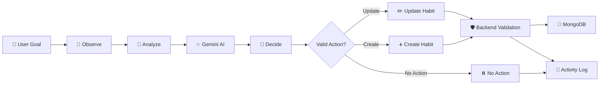
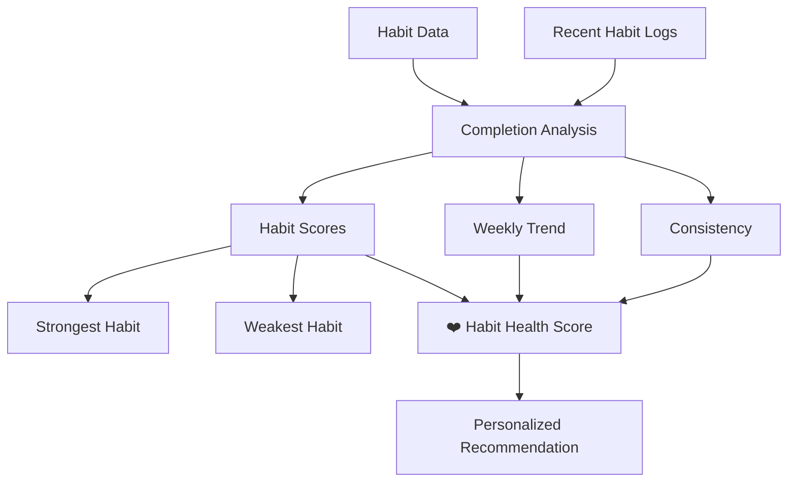
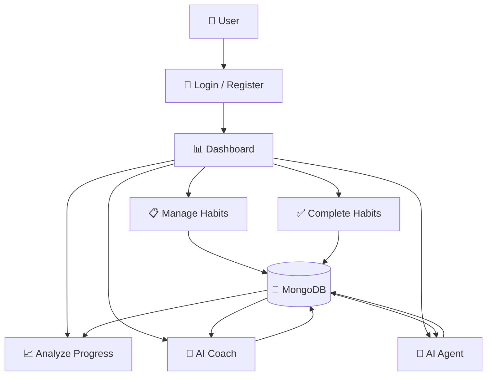

AI Habit Tracker

  An AI-powered habit tracking platform that doesn't just track what you do — it understands your behavior and helps you improve.

AI Habit Tracker is a full-stack MERN web application that combines habit tracking, progress analytics, AI coaching, personalized recommendations, habit health scoring, and an autonomous AI agent into one platform.

The goal is simple:

Track → Understand → Improve → Build Better Habits
_________________________________________________________________________________________________

The architecture diagram can look like this
```mermaid
      flowchart TD

    U["USER<br/>AI Habit Tracker"]

    UI["React + Vite UI<br/><br/>Dashboard<br/>Habit Tracking<br/>AI Reports<br/>Habit Health<br/>AI Suggestions<br/>AI Agent"]

    API["Express / Node.js<br/><br/>Auth Middleware<br/>Habit Controllers<br/>Log Controllers<br/>AI Controllers<br/>AI Agent Service"]

    DB["MongoDB Atlas<br/><br/>Users<br/>Habits<br/>Habit Logs<br/>AI Insights<br/>Agent Activity"]

    GEMINI["Google Gemini<br/><br/>AI Analysis<br/>Suggestions<br/>Reports<br/>Agent Decisions<br/>Motivation"]

    AGENT["Autonomous AI Decision<br/><br/>OBSERVE → ANALYZE<br/>→ DECIDE → EXECUTE<br/>→ RECORD"]

    RESULT["Habit automatically<br/>improved / created"]


    U --> UI
    UI -->|"REST API"| API

    API --> DB
    API --> GEMINI

    GEMINI --> AGENT
    AGENT --> RESULT
    ```
_________________________________________________________________________________________________

🚀 Why AI Habit Tracker?

Traditional habit trackers mainly answer:
   "Did you complete your habit?"

AI Habit Tracker goes further:

  "How consistent am I?"
  "Which habit needs attention?"
  "Why is my progress declining?"
  "What should I improve?"
  "Can AI take an action for me?"

The application analyzes a user's habits and recent activity to provide personalized insights and, when appropriate, allows an AI Agent to take a controlled action such as improving an existing habit or creating a useful new one.

_________________________________________________________________________________________________

✨ Key Features

📋 Smart Habit Tracking
.   Create, edit and delete habits
.   Archive habits
.   Daily habit completion
.   Weekly progress tracking
.   Habit categories
.   Daily and weekly frequencies
.   Custom target days
.   Habit descriptions and icons

_________________________________________________________________________________________________

📊 Progress Analytics
The dashboard provides a complete overview of habit performance:

.  Today's completion percentage
.  Weekly completion rate
.  Current streak
.  Longest streak
.  Active streaks
.  90-day activity history
.  Weekly habit grid
.  Activity heatmap

This allows users to understand their behavior instead of simply checking boxes.

_________________________________________________________________________________________________

🧠 AI Habit Health
The application calculates an overall Habit Health Score (0–100) based on the user's habit activity.

The AI Health system provides:

.  Overall health score
.  Health level
.  Consistency score
.  Strongest habit
.  Weakest habit
.  Missed habits
.  Active streaks
.  Weekly trend
.  Strengths
.  Areas for improvement
.  Personalized recommendation

_________________________________________________________________________________________________

Example:

Habit Health: 78/100
Level: Strong

Strongest habit:
Reading — 100%

Needs improvement:
Exercise — 57%

Recommendation:
Focus on Exercise by reducing the difficulty
and rebuilding consistency this week.

_________________________________________________________________________________________________

🤖 AI Habit Coach
The application integrates Google's Gemini AI to provide personalized assistance.
AI capabilities include:

.  Weekly reports
.  Habit suggestions
.  Recovery plans
.  Habit analysis
.  Morning motivation
.  Conversational habit coaching

The AI receives relevant habit and activity data rather than generating completely generic advice.

_________________________________________________________________________________________________

🧩 Autonomous AI Agent
One of the main features of the project is the AI Habit Agent.

Instead of only giving recommendations, the agent can analyze the user's current situation and choose an appropriate action.

The agent supports:
* update_habit
* create_habit
* no_action

For example:

*User's habit:
Exercise  →  Target: 7 days/week

Recent activity:
Very low completion

AI Agent decision:
Reduce target to 4 days/week

Reason:
The current target may be too difficult to maintain consistently.

The backend validates the AI's decision before executing it.

This creates a controlled:

Observe → Analyze → Decide → Validate → Execute → Record

workflow.

_________________________________________________________________________________________________

📝 AI Agent Activity History
Every autonomous action is recorded.
The activity system stores:

.  Action
.  Habit
.  Changes
.  Status
.  Timestamp

Possible statuses include:
* executed
* skipped
* failed
This provides transparency into what the AI agent actually did.

_________________________________________________________________________________________________

🔐 Secure AI Agent Execution

The AI does not receive unrestricted access to the database.

The backend controls the available actions.

The agent can only perform predefined operations:

* update_habit
* create_habit
* no_action

The backend also validates:

.  User ownership
.  Habit existence
.  Allowed categories
.  Allowed frequencies
.  Target day limits
.  Duplicate habits
.  Valid AI responses

This makes the AI agent more predictable and safer to use.

_________________________________________________________________________________________________

💪 Streak Recovery

If a user previously maintained a strong streak but has stopped completing a habit, the application can detect the situation and provide a recovery prompt.

Instead of treating a broken streak as failure, the system encourages the user to restart with a manageable action.

_________________________________________________________________________________________________

🎯 AI Habit Suggestions

Users can ask the AI for personalized habit ideas.

Suggested habits can include:

.  Health
.  Mindfulness
.  Productivity
.  Social
.  Finance
.  Creative
.  Other

Users remain in control and can choose whether to accept a suggestion.

_________________________________________________________________________________________________

🎉 Motivation & Engagement

The application includes:

.  Morning motivation
.  Progress rings
.  Streak indicators
.  Completion celebrations
.  Confetti animations
.  Recovery prompts
.  AI recommendations

The goal is to make consistency rewarding rather than stressful.

_________________________________________________________________________________________________

🏗️ System Architecture

The application follows a full-stack MERN architecture.

```mermaid
flowchart TD

    U[👤 User]

    FE[🖥️ React + Vite Frontend]

    API[⚙️ Express REST API]

    AUTH[🔐 Authentication Middleware]

    HC[📋 Habit Controllers]

    LC[📊 Habit Log Controllers]

    AIC[🧠 AI Controllers]

    AGENT[🤖 Autonomous AI Agent]

    HEALTH[❤️ Habit Health Engine]

    DB[(🍃 MongoDB Atlas)]

    GEMINI[✨ Google Gemini AI]

    ACTIVITY[📝 Agent Activity History]

    U --> FE

    FE --> API

    API --> AUTH

    AUTH --> HC
    AUTH --> LC
    AUTH --> AIC
    AUTH --> AGENT
    AUTH --> HEALTH

    HC --> DB
    LC --> DB
    HEALTH --> DB
    ACTIVITY --> DB

    AIC --> GEMINI

    AGENT --> GEMINI
    GEMINI --> AGENT

    AGENT --> HC
    AGENT --> ACTIVITY

    DB --> FE
    API --> FE

```
_________________________________________________________________________________________________

🤖 Autonomous AI Agent Workflow

The most important AI workflow in the application:


Agent decision process

The agent follows seven stages:

1. Observe

Collect the user's active habits and recent completion history.

2. Analyze

Gemini analyzes the current routine and identifies a potential problem or opportunity.

3. Decide

The AI chooses exactly one action.

4. Validate

The backend validates the AI's response.

5. Execute

Only approved actions are executed.

6. Record

The action and reason are stored in AgentActivity.

7. Return Result

The frontend receives the result and displays what happened.

_________________________________________________________________________________________________

🧠 AI Health Score Workflow

_________________________________________________________________________________________________

🛠️ Technology Stack
Frontend
. React
. Vite
. JavaScript
. Tailwind CSS
. Lucide React
. Axios
. date-fns
Backend
. Node.js
. Express.js
. JavaScript / ES Modules
. Mongoose
. JWT Authentication
Database
. MongoDB
. MongoDB Atlas
Artificial Intelligence
. Google Gemini
. Google AI API
. AI-powered habit analysis
. AI recommendations
. Autonomous AI agent
Development & Deployment
. Git
. GitHub
. Vite
. Node.js
. Cloud deployment

_________________________________________________________________________________________________

📁 Project Structure

AIHABITTRACKER/
│
├── backend/
│   │
│   ├── controllers/
│   │   ├── aiController.js
│   │   ├── aiHealthController.js
│   │   ├── habitController.js
│   │   └── ...
│   │
│   ├── models/
│   │   ├── User.js
│   │   ├── Habit.js
│   │   ├── HabitLog.js
│   │   ├── AIInsight.js
│   │   └── AgentActivity.js
│   │
│   ├── routes/
│   │   ├── ai.js
│   │   ├── habits.js
│   │   └── ...
│   │
│   ├── services/
│   │   └── aiAgent.js
│   │
│   ├── utils/
│   │   ├── aiService.js
│   │   └── dateHelpers.js
│   │
│   └── server.js
│
├── frontend/
│   │
│   ├── src/
│   │   ├── components/
│   │   ├── pages/
│   │   ├── context/
│   │   ├── utils/
│   │   └── api/
│   │
│   ├── public/
│   └── ...
│
├── .gitignore
└── README.md
_________________________________________________________________________________________________

🔄 Application Flow

_________________________________________________________________________________________________

🔐 Security & Data Protection

Sensitive environment variables are kept outside the source code.

Example:

* backend/.env
* frontend/.env

These files are excluded from Git using .gitignore.
Only safe environment templates such as:

* backend/.env.example
* frontend/.env.example

can be shared publicly.

Authentication middleware protects private API routes, and the AI Agent verifies that a habit belongs to the authenticated user before modifying it.

_________________________________________________________________________________________________

🎯 Hackathon Innovation

The core idea behind AI Habit Tracker is:

Don't just use AI to talk to the user. Use AI to understand behavior and take a controlled action.
Most habit trackers focus on:

* Habit → Checkbox → Statistics

AI Habit Tracker expands this into:

Habit
   ↓
Behavior Data
   ↓
Analysis
   ↓
AI Reasoning
   ↓
Decision
   ↓
Validated Action
   ↓
Improved Habit

This creates a more proactive habit management experience.
_________________________________________________________________________________________________

🌟 Example Use Case

Imagine a user has:

🏃 Exercise
Target: 7 days/week

Recent completion:
Mon ✅
Tue ❌
Wed ❌
Thu ❌
Fri ❌
Sat ❌
Sun ❌

Instead of simply showing:
"You failed your streak."
The AI Agent can reason:
The current target appears difficult to maintain.
Then propose an actionable change:

* Action:
update_habit

* Change:
7 days/week → 4 days/week

* Reason:
A smaller target may improve consistency
and make the routine more sustainable.

The backend validates and executes the change, then records the action.
_________________________________________________________________________________________________

🚀 Future Improvements

Planned possibilities include:

. Voice-based habit coaching
. Smarter long-term behavior analysis
. Calendar integration
. Personalized habit difficulty
. Adaptive goals
. AI-generated weekly plans
. Push notifications
. Wearable integration
. More autonomous agent actions
. Advanced behavioral predictions
. Habit correlations and pattern detection
_________________________________________________________________________________________________
🏁 Getting Started
1. Clone the repository

* git clone YOUR_GITHUB_REPOSITORY_URL
* cd AIHABITTRACKER

2. Install backend dependencies
* cd backend
* npm install

3. Configure backend environment variables
Create:
* backend/.env
Example:
* MONGO_URI=your_mongodb_connection
* JWT_SECRET=your_secret
* GEMINI_API_KEY=your_gemini_api_key
* GEMINI_MODEL=gemini-2.5-flash
* CLIENT_URL=http://localhost:5173

CLIENT_URL=http://localhost:5173
4. Start backend
* npm run dev
5. Install frontend dependencies
Open another terminal:
* cd frontend
* npm install
6. Configure frontend environment
Create:
* frontend/.env
Add your frontend API configuration.
7. Start frontend
* npm run dev
_________________________________________________________________________________________________

👨‍💻 Project

AI Habit Tracker

Built as a full-stack AI-powered habit management platform using the MERN stack and Google Gemini.
_________________________________________________________________________________________________
💡 One sentence for the hackathon judges

You can also put this near the top of the README:

AI Habit Tracker transforms a passive habit tracker into a proactive AI coach by analyzing user behavior, identifying opportunities for improvement, and safely taking actionable habit-management decisions.

That sentence clearly communicates what makes your project different, which is exactly what you want a judge to understand quickly.


